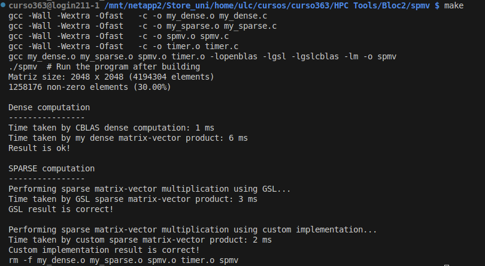

# SpMV: Sparse Matrix-Vector product

Use this code skeleton for the associated tasks in HPCTools.

This code is based on the use of GSL (GNU Scientific Library) for the
implementation of the baseline operations used for comparison:
- dense matrix-vector product: `cblas_dgemv()`, you need to link against *libgslcblas*
- sparse matrix-vector product: `gsl_spblas_dgemv()`, you need to link against *libgsl*

The dense product, cblas_dgemv(), can be found in other CBLAS
implementation. You just need to change the library to be linked,
eg. `-lopenblas` instead of `-lgslcblas`

The basetype in GSL for working with sparse matrices is `gsl_spmatrix`.
GSL also provides functions to help convert you dense matrices into a
sparse format.


# TASK 1

# Matrix-Vector Product for Sparse Matrices

## Purpose

The goal of this GitHub repository is to implement various methods for performing Matrix-Vector products when the matrices are sparse. Initially, the product is calculated using a simple method, followed by a transformation to Compressed Sparse Row (CSR) format to compare the speed of calculations.

## Branches

To compile the program, please ensure you are on the `dev` branch, where I have developed the code. The `main` branch contains the original code from your GitHub.

To switch to the `dev` branch, run the following command in your terminal:

```bash
git checkout dev
```

## Compilation

To compile the program, simply use the make command:

```bash
make
```

Upon successful compilation and execution, you can expect an output similar to the following:



### Summary

This README outlines the project purpose, instructions for compiling the code, example output, and important notes regarding performance. You can adjust any section to fit your personal style or add more details if necessary. Let me know if you need further adjustments!
