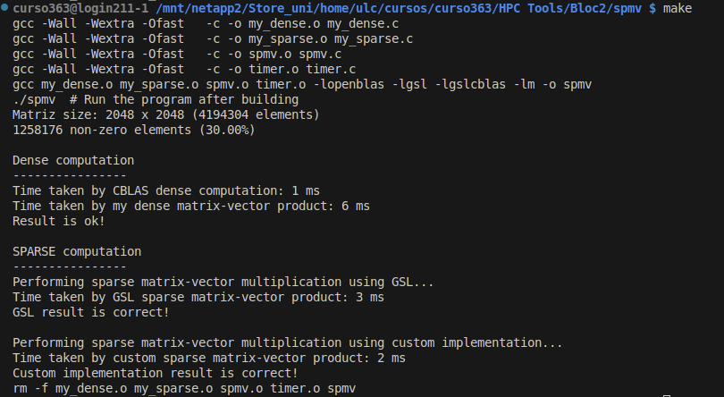
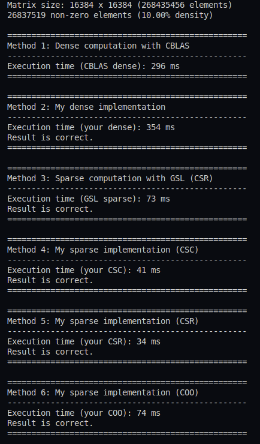

# SpMV: Sparse Matrix-Vector Product

Use this code skeleton for the associated tasks in HPCTools.

This code is based on the use of GSL (GNU Scientific Library) for the implementation of the baseline operations used for comparison:

- Dense matrix-vector product: `cblas_dgemv()`, you need to link against _libgslcblas_
- Sparse matrix-vector product: `gsl_spblas_dgemv()`, you need to link against _libgsl_

The dense product, `cblas_dgemv()`, can be found in other CBLAS implementations. You just need to change the library to be linked, e.g., `-lopenblas` instead of `-lgslcblas`.

The base type in GSL for working with sparse matrices is `gsl_spmatrix`. GSL also provides functions to help convert your dense matrices into a sparse format.

## TASK 1

### Basic SpMV

#### Purpose

The goal of this GitHub repository is to implement various methods for performing Matrix-Vector products when the matrices are sparse. Initially, the product is calculated using a simple method, followed by a transformation to Compressed Sparse Row (CSR) format to compare the speed of calculations.

#### Branches

To compile the program, please ensure you are on the `dev` branch, where I have developed the code. The `main` branch contains the original code from the GitHub repository.

To switch to the `dev` branch, run the following command in your terminal:

```bash
git checkout dev
```

#### Compilation

To compile the program, simply use the make command:

```bash
make
```

Upon successful compilation and execution, you can expect an output similar to the following:



## TASK 2

### SpMV Benchmarking

#### Overview

In Task 2, we extended our work from Task 1 by implementing additional methods for performing Sparse Matrix-Vector (SpMV) products. Specifically, we implemented the **COO (Coordinate Format)** and **CSC (Compressed Sparse Column)** versions of SpMV. This allowed us to compare the performance of four different sparse matrix storage formats:

- **Dense**
- **CSR (Compressed Sparse Row)**
- **COO (Coordinate Format)**
- **CSC (Compressed Sparse Column)**

I organized our code by creating separate `.c` files for each method to keep the implementations modular and maintainable.

#### Compilation and Execution Without Optimization

I created a special `Makefile` to work with the two benchmarking scripts (`runGCC.sh` and `runICC.sh`). However, it's still possible to compile and run the `spmv.c` program without any optimization by executing the following commands in the terminal:

```bash
make clean
make
./spmv
```

This will compile the program and execute it, printing the execution times of the six methods we have programmed.

#### Benchmarking with Different Compilers and Optimizations

I created two shell scripts to automate the benchmarking process with different compilers and optimization flags:

- `runGCC.sh` for the **GCC** compiler
- `runICC.sh` for the **ICC** compiler

These scripts compile and run `spmv.c` with various optimization flags and collect the execution times into a table.

Here is an exemple of results I obtained :



##### Running the Benchmark Scripts

To run the benchmark with GCC, use:

```bash
sbatch runGCC.sh
```

To run the benchmark with ICC, use:

```bash
sbatch runICC.sh
```

You will receive the results in two files: `spmv_benchmark_output_gcc.out` and `spmv_benchmark_output_icc.out`. I have kept my results in these files so that you can see what they look like and the results we obtained during a run for each compiler.

#### Results

We ran each script **five times** and compiled a table summarizing the average execution times (in milliseconds) for each method under different optimization levels.

##### GCC Compiler Benchmark Results

| Function | O0 (ms) | O2-novec (ms) | O3-vec (ms) | Ofast (ms) | Ref (ms) |
| -------- | ------- | ------------- | ----------- | ---------- | -------- |
| my_dense | 1097    | 660           | 1008        | 1048       | 1034     |
| my_CSC   | 152     | 69            | 115         | 116        | 113      |
| my_CSR   | 140     | 65            | 112         | 114        | 112      |
| my_COO   | 170     | 106           | 140         | 142        | 144      |

##### ICC Compiler Benchmark Results

| Function | O0 (ms) | O2-novec (ms) | O3-vec (ms) | Ofast (ms) | Ref (ms) |
| -------- | ------- | ------------- | ----------- | ---------- | -------- |
| my_dense | 892     | 398           | 150         | 158        | 176      |
| my_CSC   | 143     | 34            | 36          | 38         | 36       |
| my_CSR   | 120     | 42            | 39          | 45         | 42       |
| my_COO   | 155     | 89            | 86          | 93         | 85       |

#### Conclusion

From the benchmark results, we can draw several conclusions about the performance of different SpMV implementations and the impact of compiler optimizations:

1. **Compiler Impact**: The **ICC compiler** generally produces faster executables compared to **GCC**, especially at higher optimization levels. For instance, `my_dense` at `O3-vec` with ICC is significantly faster than with GCC.

2. **Optimization Levels**:

   - **No Optimization (`O0`)**: As expected, all methods run slower without any optimization. This effect is more pronounced in the `my_dense` method due to the lack of compiler optimizations.

   - **Disable Vectorization (`O2-novec`)**: Disabling vectorization leads to slower execution times compared to when vectorization is enabled (`O3-vec`), highlighting the importance of vectorization in numerical computations.

   - **Enable Vectorization (`O3-vec`, `Ofast`)**: Enabling vectorization and aggressive optimizations improves performance, particularly for the dense computations. The sparse methods also benefit, but to a lesser extent.

3. **Method Comparison**:

   - **Dense vs. Sparse**: The sparse implementations (`my_CSC`, `my_CSR`, `my_COO`) are significantly faster than the dense implementation (`my_dense`), demonstrating the efficiency of using sparse storage formats for matrices with a high proportion of zero elements.

   - **Sparse Formats**: Among the sparse methods, `my_CSC` and `my_CSR` generally perform better than `my_COO`. This could be due to the overhead associated with the COO format and the efficiency gains from the compressed formats.

4. **Effect of ICC Compiler**: The ICC compiler shows more significant improvements with higher optimization levels, particularly for the dense method. This suggests that ICC's optimization techniques are highly effective for computationally intensive code.

#### Summary

By implementing and benchmarking different sparse matrix storage formats and compiling with various optimization levels using both GCC and ICC compilers, we have demonstrated the importance of choosing the appropriate data structures and compiler optimizations for high-performance numerical computations.

Our results show that:

- **Using sparse matrix formats** can greatly reduce computation time for matrices with many zero elements.
- **Compiler optimizations**, especially vectorization, have a significant impact on performance.
- The **choice of compiler** can affect the execution time, with ICC providing better performance in our tests.
